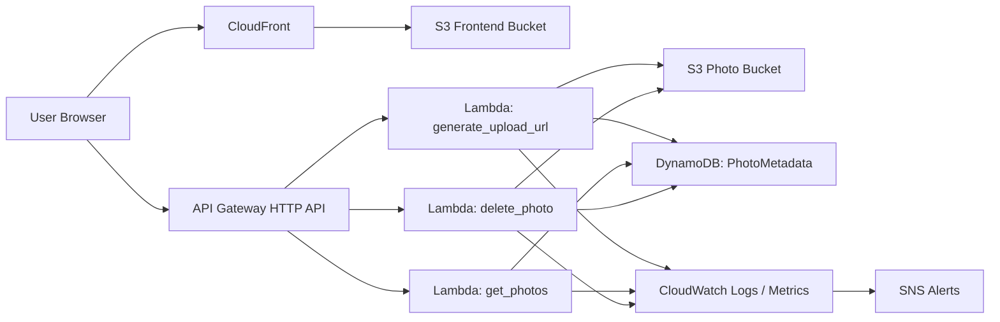

# Cloud Photo Gallery

A serverless photo gallery built on AWS for uploading, viewing, and managing user images securely. The project uses S3 for object storage, Lambda for serverless logic, API Gateway for HTTP routes, DynamoDB for metadata, CloudFront for frontend delivery, and CloudWatch/SNS for monitoring and alerts.

## Overview

This application allows users to:

- upload photos from a browser
- store the actual files in Amazon S3
- save metadata in DynamoDB
- view uploaded photos in a gallery UI
- delete uploaded photos
- access the app through CloudFront over HTTPS
- monitor Lambda/API health with CloudWatch alarms and SNS notifications

## Architecture



## Current AWS stack

| Layer | AWS service | Purpose |
| --- | --- | --- |
| Frontend | S3 + CloudFront | Host the static gallery UI and serve it via HTTPS |
| Image storage | S3 | Store uploaded user photos |
| Metadata | DynamoDB | Store photo metadata and user photo indexes |
| API | API Gateway HTTP API | Expose upload, list, and delete routes |
| Compute | Lambda | Handle upload URL generation, photo listing, and deletion |
| Monitoring | CloudWatch + SNS | Track Lambda/API errors and send alerts |

## Repository structure

```text
.
├── .github/
│   └── workflows/
│       └── deploy.yml            # CI/CD workflow for validation and AWS deployment
├── backend/
│   ├── __init__.py
│   ├── delete_photo.py
│   ├── generate_upload_url.py
│   ├── get_photos.py
│   ├── lambda_utils.py
│   ├── photos.py
│   └── upload.py
├── docs/
│   └── github-actions-setup.md
├── frontend/
│   ├── app.js
│   ├── index.html
│   └── style.css
├── terraform/
│   ├── api_gateway.tf
│   ├── backend.tf
│   ├── cloudfront.tf
│   ├── dynamodb.tf
│   ├── iam.tf
│   ├── lambda.tf
│   ├── main.tf
│   ├── monitoring.tf
│   ├── outputs.tf
│   ├── providers.tf
│   ├── s3.tf
│   ├── variables.tf
│   └── terraform.tfstate
├── tests/
│   ├── test_photos.py
│   └── test_upload.py
├── README.md
├── .gitignore
└── requirements.txt
```

## Application flow

1. The user visits the frontend through the CloudFront domain.
2. The frontend lets the user select an image and supply metadata.
3. The frontend calls the API Gateway route for a signed upload URL.
4. Lambda creates a private upload URL and stores metadata in DynamoDB.
5. The browser uploads the image directly to S3.
6. The gallery loads photo metadata via the `get_photos` Lambda route.
7. Deletion removes the object from S3 and the metadata record from DynamoDB.

## Included features

- private S3 buckets for frontend and photo storage
- CloudFront distribution in front of the static frontend
- IAM roles with least-privilege access
- DynamoDB table with user-based secondary index
- Lambda handlers for upload URL generation, photo retrieval, and deletion
- API Gateway HTTP routes for gallery operations
- logging and alarms in CloudWatch
- SNS email notifications for important alerts
- Terraform-managed infrastructure and deployment workflow

## API routes

The current backend API exposes these routes:

- `POST /upload-url`
- `GET /photos`
- `DELETE /photos/{id}`

The routes are configured in [terraform/api_gateway.tf](terraform/api_gateway.tf), and the Lambda handlers live in the [backend](backend) directory.

## Environment and configuration

### Terraform variables

The Terraform config is driven by values in [terraform/variables.tf](terraform/variables.tf):

- `aws_region`
- `frontend_bucket_name`
- `photos_bucket_name`
- `photo_metadata_table_name`
- `alert_email`

### Lambda environment variables

The Lambda functions use:

- `PHOTOS_BUCKET_NAME`
- `PHOTO_METADATA_TABLE_NAME`
- `ALLOWED_ORIGIN`
- `UPLOAD_URL_EXPIRY_SECONDS`

These are configured in [terraform/lambda.tf](terraform/lambda.tf).

## Deployment workflow

The GitHub Actions workflow in [.github/workflows/deploy.yml](.github/workflows/deploy.yml) does the following:

1. checks that frontend files exist
2. validates JavaScript syntax
3. runs Terraform formatting checks
4. validates Terraform configuration
5. creates or reuses the Terraform state bucket
6. initializes the S3 backend
7. applies the Terraform stack
8. syncs the frontend assets to the frontend S3 bucket

## Terraform state setup

Terraform is configured to use a dedicated S3 backend for state management in [terraform/backend.tf](terraform/backend.tf):

- bucket: `photos-gallery-terraform-state-gloria-2026`
- key: `cloud-photo-gallery/terraform.tfstate`
- region: `us-east-1`

This keeps infrastructure state separate from application data buckets and avoids state drift during repeated deployments.

## Local development and deployment

### Prerequisites

- Terraform v1.5+
- AWS CLI configured with valid credentials
- an AWS account with permission to manage:
  - S3
  - CloudFront
  - Lambda
  - API Gateway
  - DynamoDB
  - IAM
  - CloudWatch
  - SNS

### Deploy infrastructure

```bash
cd terraform
terraform init
terraform plan
terraform apply
```

### Sync frontend assets

```bash
aws s3 sync ../frontend/ "s3://photos-gallery-frontend-gloria-2026/" --delete
```

### Access the frontend

Use the CloudFront domain name output by Terraform, for example:

```text
https://<cloudfront-domain-name>
```

The command below retrieves the CloudFront domain name:

```bash
cd terraform
terraform output -raw cloudfront_domain_name
```

## Security notes

- frontend and photo buckets block public access
- CloudFront uses Origin Access Control to access the frontend bucket privately
- Lambda permissions are scoped to the required S3 and DynamoDB resources
- the current app is a learning project and should add proper authentication and authorization before production use
- S3 photo content is private, and upload URLs are signed with expirations

## Current project status

This repository currently implements the core serverless photo gallery architecture and deployment flow for a cloud-hosted app, including:

- static frontend hosting through CloudFront
- private photo storage in S3
- Lambda-backed API layer
- DynamoDB metadata storage
- infrastructure-as-code with Terraform
- monitoring and alerting using CloudWatch and SNS

## Future improvements

Recommended next upgrades include:

- authenticated user sessions and authorization
- custom domain with Route53 + ACM
- photo thumbnails and image optimization
- lifecycle rules for S3 object cleanup and archiving
- richer metadata filtering and tag-based searching
- production-grade CI/CD validation across staging and production
